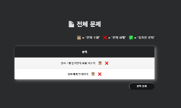
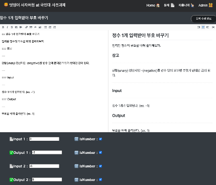
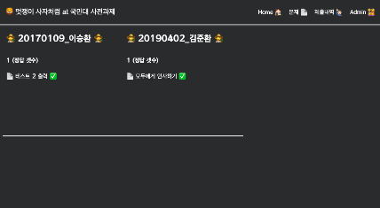

# 🦁 kmu 멋쟁이 사자처럼 Algorithm judge Application

## 🙇‍♂️ Developer

- 이승환

## 📄 Description

멋쟁이 사자처럼 지원자들의 역량을 평가하기 위해 만든 algorighrm judge SPA 앱입니다.
대표적으로는 React 와 Firebase 를 사용하였습니다.

## 🖥 Demo









* `Live Demo viodeo on Youtube video:` <a href="https://www.youtube.com/watch?v=XMJ8WFAH_tE&ab_channel=%EC%9D%B4%EC%8A%B9%ED%99%98" target="\_blank">https://www.youtube.com/watch?v=XMJ8WFAH_tE&ab_channel=%EC%9D%B4%EC%8A%B9%ED%99%98</a>
* `Live Demo on Netlify:` <a href="https://kmumutsaalgo.netlify.app/" target="\_blank">https://kmumutsaalgo.netlify.app/</a>

## 🎠 기능

#### 👨‍👩‍👧‍👧 Admin

- [x] **문제 출제**
- [x] **문제 수정**
- [x] **문제 삭제**
- [x] **지원자 소스코드 및 정답개수 확인**

#### 👩‍🌾 User

- [x] **로그인**
- [x] **로그아웃**
- [x] **문제 풀이**
- [x] **제출한 소스코드 확인**
- [x] **제출한 소스코드 삭제**

#### 💻 System

- [x] **Suspense & lazy 사용하여 로딩 화면 구현**
- [x] **유저 소스코드 제출시 테스트 이후 통과 여부 display**

## 📀 Setup Locally

have to create dotenv file at root dir 

```dotenv
// firebase

REACT_APP_API_KEY = ""
REACT_APP_AUTH_DOMAIN = ""
REACT_APP_PROJECT_ID = ""
REACT_APP_STORAGE_BUCKET = ""
REACT_APP_MESSAGING_SENDER_ID = ""
REACT_APP_APP_ID = ""

// judge0 CE
REACT_APP_JUDGE_KEY = ""
```

```bash
git clone https://github.com/sh981013s/mutsa_algo.git
cd musta_algo
npm install
npm run start
```

## 📚 Used packages

- "@emotion/react": "^11.7.1"
- "@emotion/styled": "^11.6.0"
- "@mui/icons-material": "^5.3.1"
- "@mui/material": "^5.4.0"
- "@uiw/react-md-editor": "^3.9.4"
- "@uiw/react-textarea-code-editor": "^1.4.16"
- "firebase": "^9.6.6"
- "framer-motion": "^6.2.6"
- "lodash": "^4.17.21"
- "marked": "^0.7.0"
- "prismjs": "^1.17.1"
- "react": "^17.0.2"
- "react-dom": "^17.0.2"
- "react-router-dom": "^5.3.0"
- "react-scripts": "5.0.0"
- "react-syntax-highlighter": "^15.4.5"
- "styled-components": "^5.3.3"


